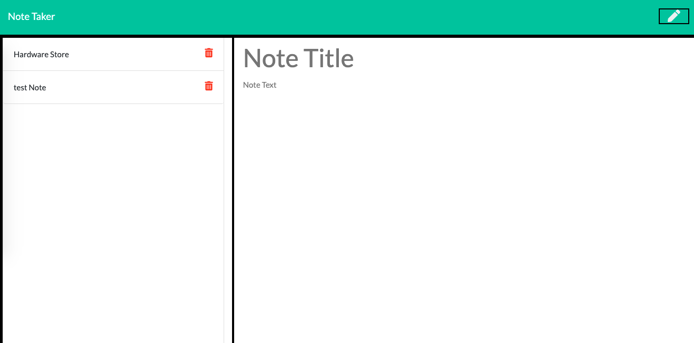

Note Taker
========

## Description 
This is an app that allows the user to take notes, save them to a note list and then delete when no longer needed. 

Notes are stored on a small database on the server while all user interaction is through the browser.

## Installation
Feel free to fork and clone the [repo](https://github.com/hkfernandez/note_taker) if you would like to play around with the code. 

## Usage 
Users are greeted with a home screen.

Once start is clicked users are directed to a page where notes can be created and viewed. Simply start typing a note tile and note. When you are happy with what you have click on the save button.

To review the contents of a saved note, click on the note in the list of saved notes. 

To delete a note, click on the delete icon beside the note. 

## Credits
I built this app myself with jQuery, Bootstrap and Node JS with Express, along with some starter code for the frontend. My primary focus was connecting the back and front ends via the server and getting the two to play together nicely.

## License
MIT
